# 倒立摆控制仿真（Python环境）

## 用法
1. 配置环境
   > 终端执行：conda env create -f inverted_pendulum_sim.yaml
2. 运行仿真
   > 解除simulator.py中所选择的控制器代码的注释，运行simulator.py

## 运行效果
- 不加控制

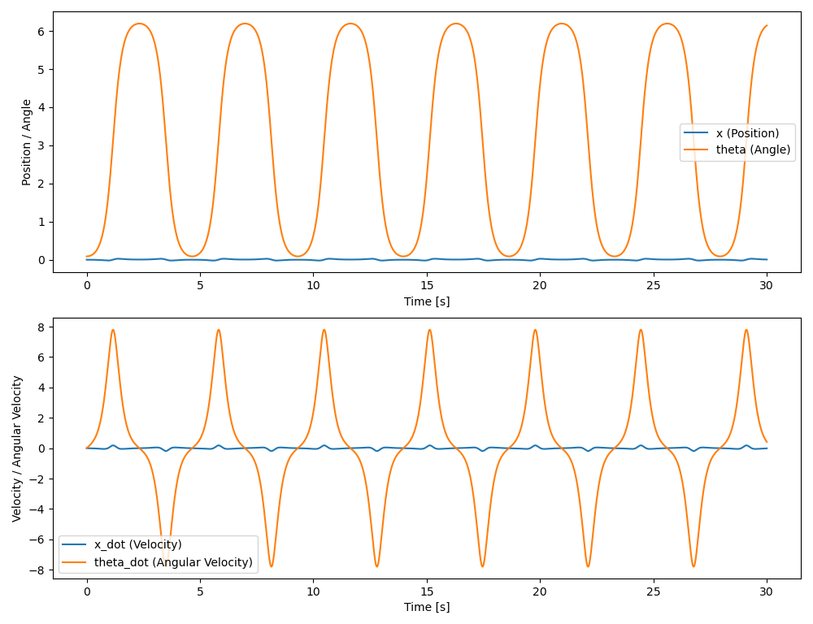
- 极点配置
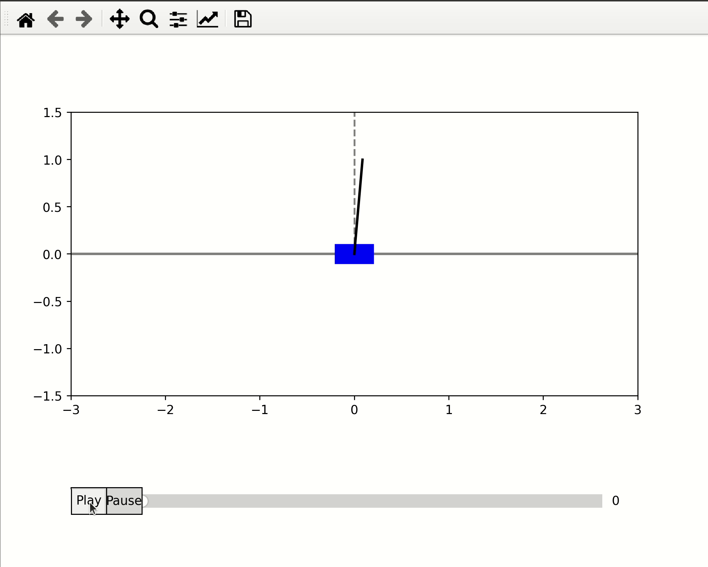
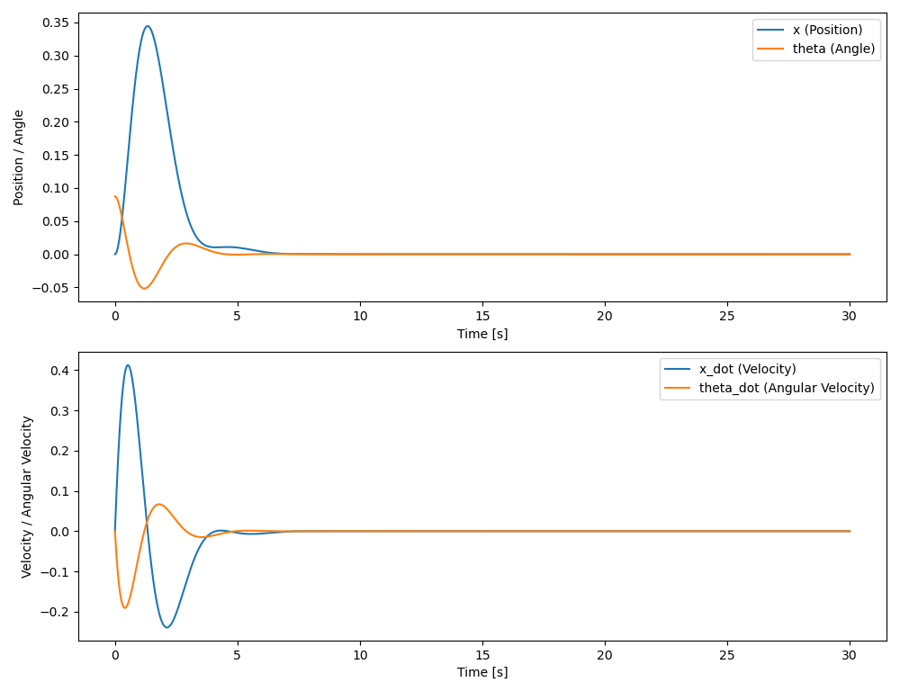
- 带观测器的极点配置

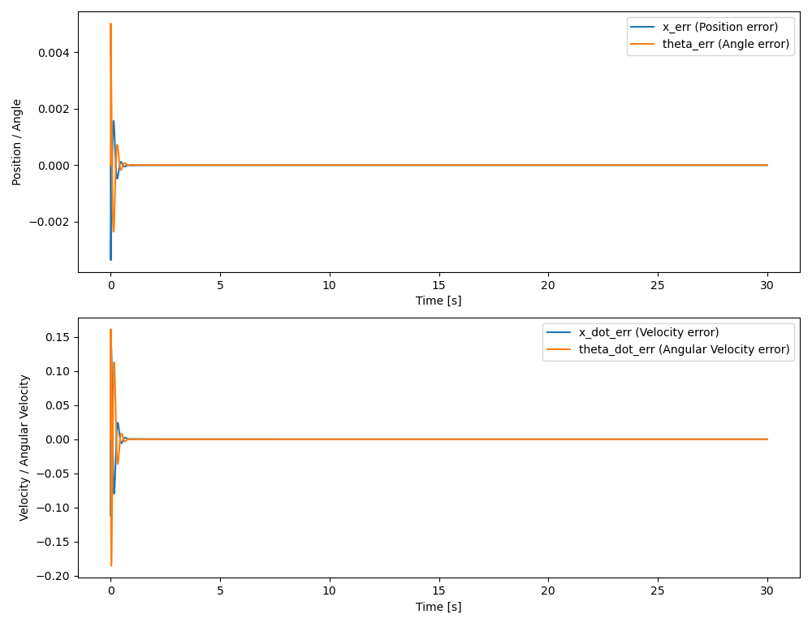
- LQR
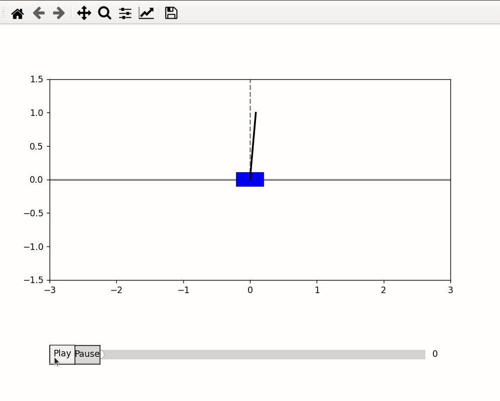
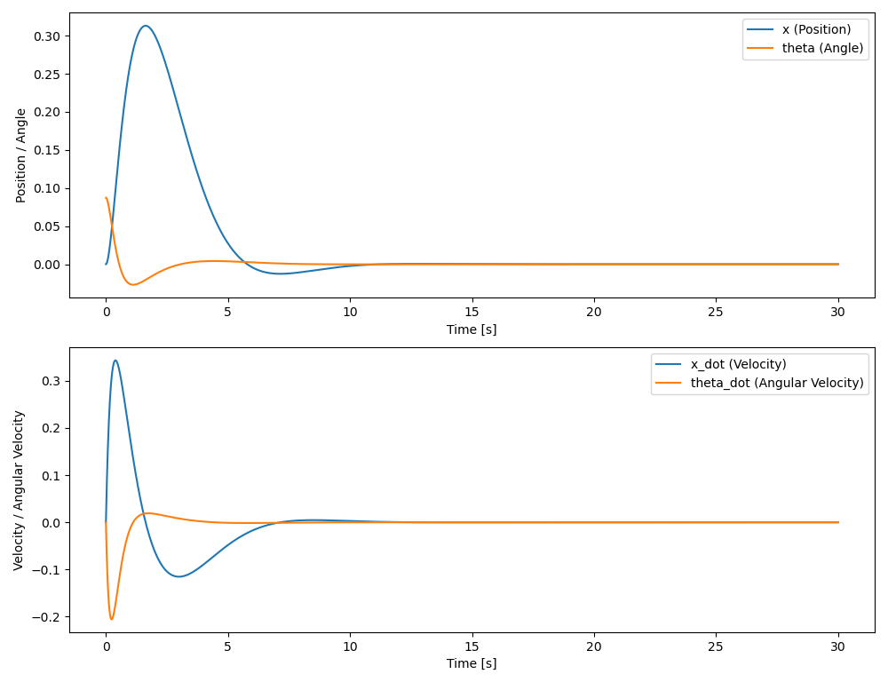
- 角度PID

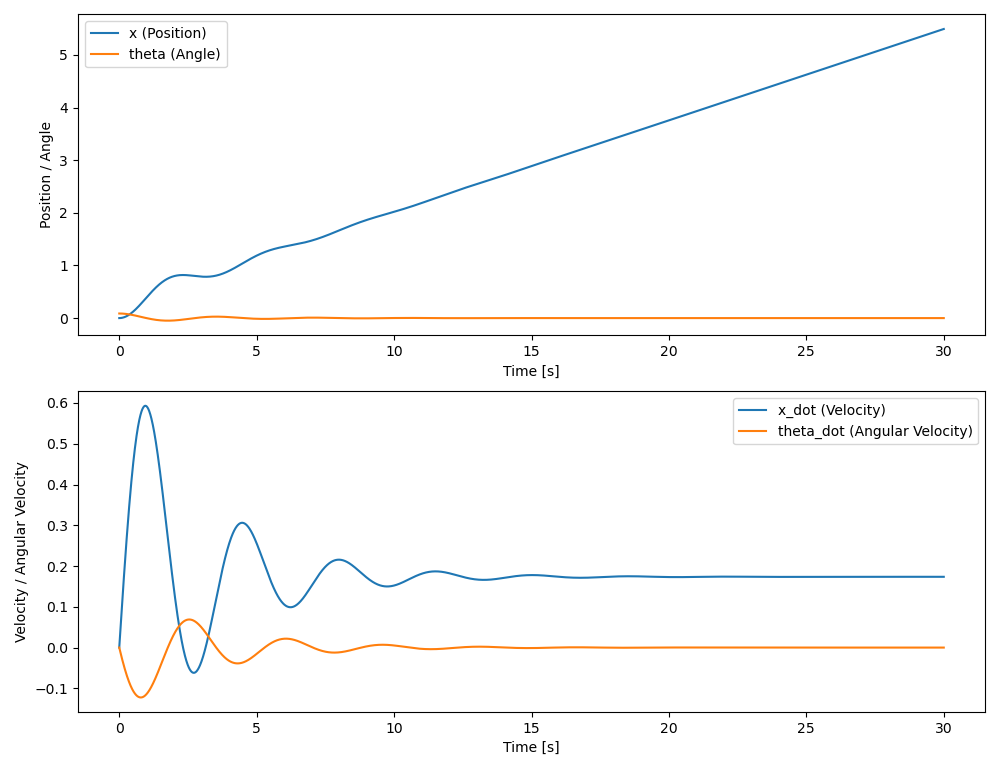
- 串级PID,角度环+角速度环

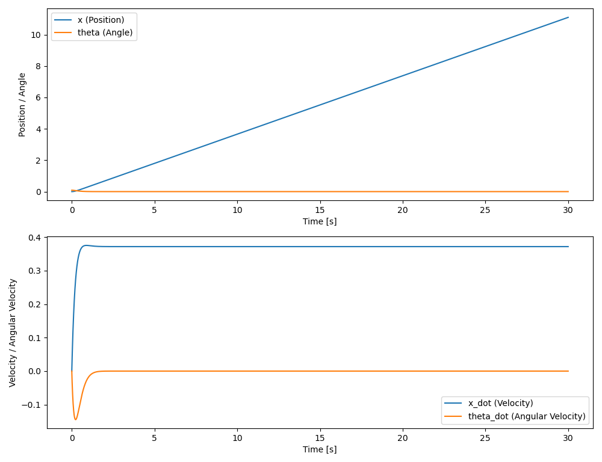
- 串级PID,位置环+角度环+角速度环
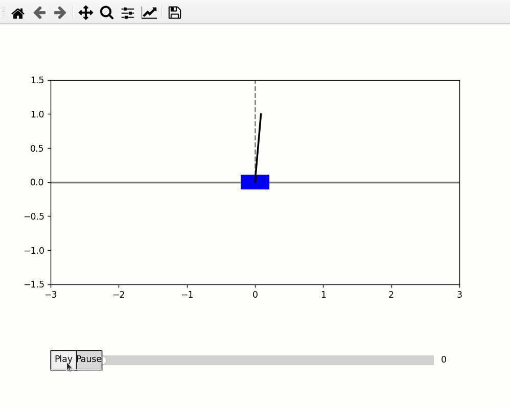
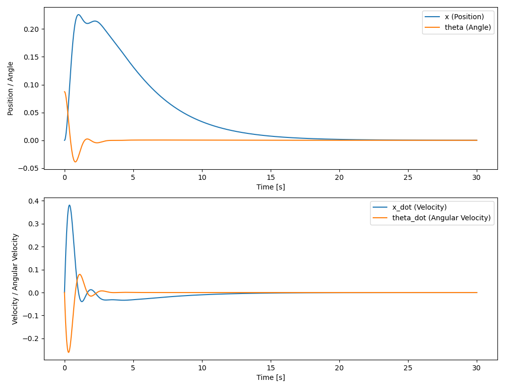
- MPC
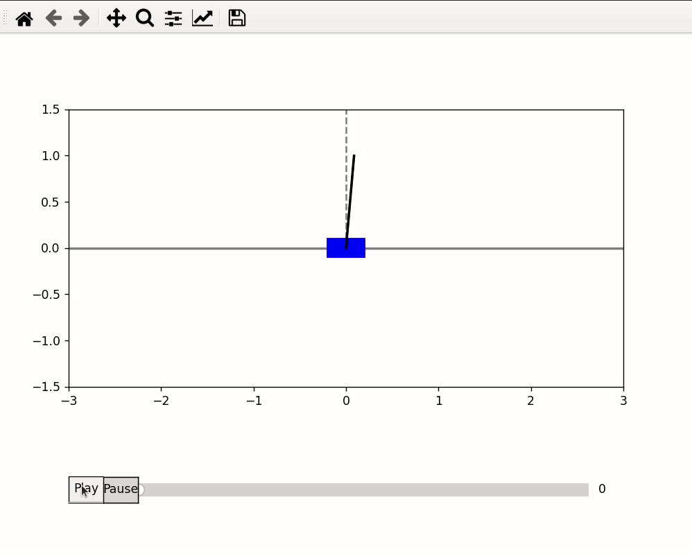
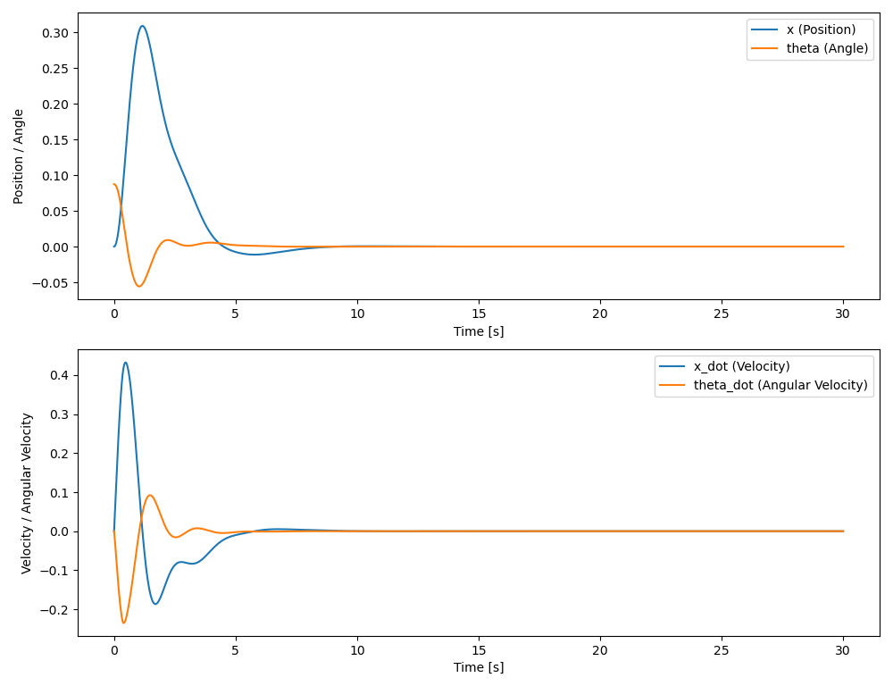